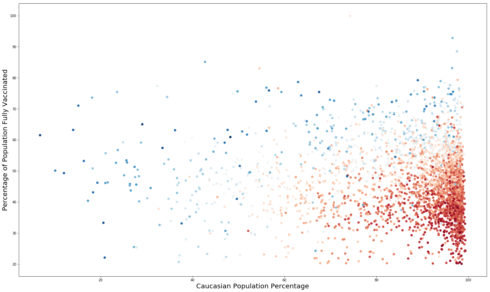
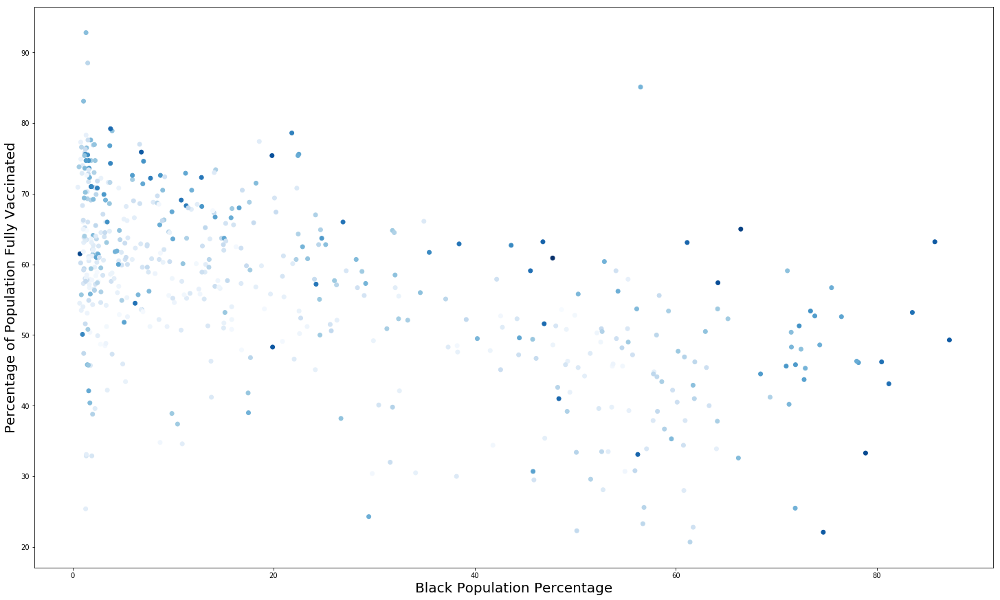
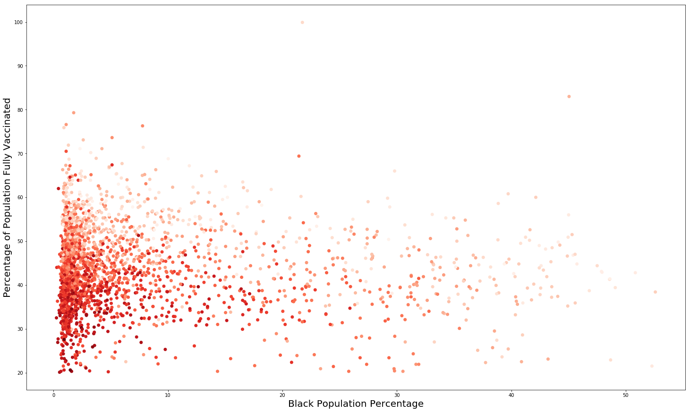
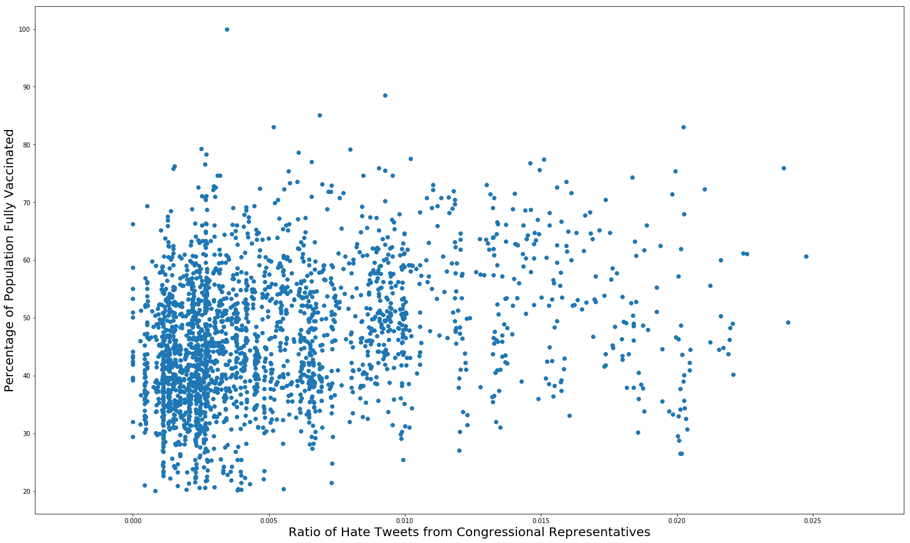

  

      <ul class="nav">
          <li><a href="{{ BASE_PATH }}/assets/Neel_Bhagwat_Resume.pdf">Resume</a></li>
          <li><a href="https://github.com/bhagwatn2021">Github</a></li>
          <li><a href="https://www.linkedin.com/in/neel-b-96bb69128/">LinkedIn</a></li>
      </ul>
  

`

### Portfolio

<table class="wide">
<tr>
  <td class="left">
        
  </td>
  <td class="right">
        
  </td>
</tr>
<tr>
  <td class="left">
   
  </td>
  <td class="right">
   
  </td>
</tr>
</table>
